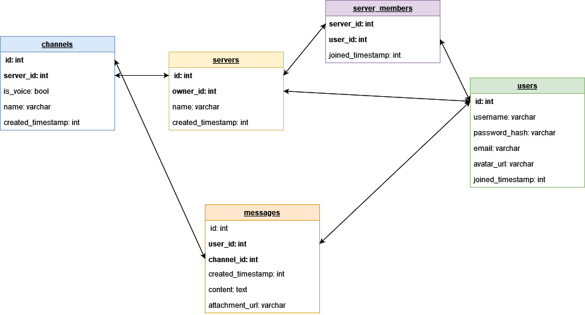
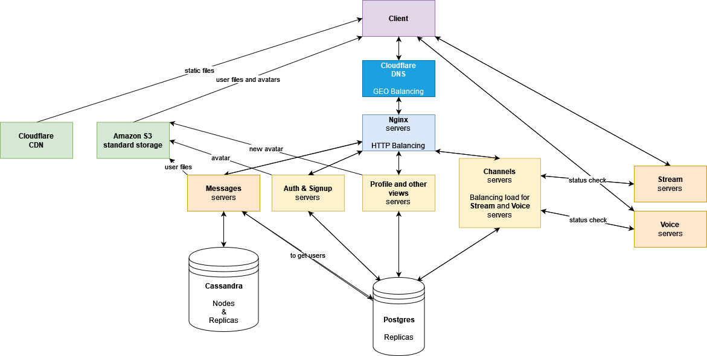

# Проектирование высоконагруженных систем. Discord.

# 0. Ссылки
* [Таблица с темами](https://docs.google.com/spreadsheets/d/1eIrm6sO18lFCoI-_ac6Xb4A8XyL840-xy8GyMia1cGQ/edit?usp=sharing)
* [Методические указания](https://github.com/init/highload/blob/main/homework_architecture.md)
* [Построение диаграмм](https://app.diagrams.net/)

# 1. Тема и целевая аудитория

## Тип сервиса

Discord - популярный мессенджер с поддержкой VoIP и видеоконференций.

## Функционал MVP

1. Регистрация
2. Авторизация
3. Создание сервера
    * Создание текстовых каналов (чатов) сервера
    * Создание голосовых каналов (лобби) сервера
4. Отправка сообщений в чат сервера (текст + до 1 прикреплённого файла)
    * Максмимальный размер сообщения - 400 символов
    * Максимальный размер прикреплённого файла - 8 МБ
5. Голосовое общение в голосовом канале сервера
6. Трансляция экрана со звуком/веб-камеры
6. Личные сообщения

## Целевая аудитория
### Размер

Источник: https://www.businessofapps.com/data/discord-statistics/
* 300 млн. зарегистрированных пользователей
* 140 млн. активных в течение месяца пользователей
* 14 млн. активных в течение дня пользователей
* 10 млн. - пик онлайна

### Расположение

Не удалось найти точные данные, но по [количеству переходов](https://www.similarweb.com/website/discord.com/#overview) на сайт Discord, можно сделать вывод, что 30% пользователей приходится на Северную Америку, а остальные пользователи равномерно распределены по всему миру:
1. Северная Америка (30%)
2. Южная Америка (17.5%)
3. Европа (17.5%)
4. Азия (17.5%)
5. Африка (17.5%)

# 2. Расчет нагрузки

## Продуктовые метрики

### Месячная аудитория

**140 млн.**

### Дневная аудитория

**14 млн.**

### Средний размер хранилища пользователя

[963 млн. сообщений в день](https://influencermarketinghub.com/discord-stats/)
=> один пользователь отправляет 963 / 14 = **69 сообщений в день**

Из личного опыта, размер сообщений колеблется 
от 29 символов (обычное сообщение, наиболее часто) до 400 символов (цитата, фрагмент кода - редко).
Будем считать средний размер сообщения равным 100 символам, 
пусть 1 символ занимает 2 байта => **200 байт на одно сообщение**

Из личного опыта, наиболее распространённый тип отправляемых файлов - изображения. 
Обычно, пользователь отправляет 2 изображения/файла в день. 
Средний размер изображения - 0.5 МБ. 
Очень редко отправляются и файлы больших размеров (до 8 МБ): гифки, видео, программы. 
Будем считать, что изображения отправляются в 95% случаев, а файлы размером 5 МБ в 5% случаев. 
Тогда средний размер файла: 0.5 * 0.95 + 5 * 0.05 = **0.725 МБ**

Большую популярность дискорд получил в [2018 году](https://www.businessofapps.com/data/discord-statistics/)
=> средний возраст аккаунта - 3 года.

Аватарка весит в среднем 1 МБ.

Аватарка: 1 МБ

Сообщения: (69 * 200 * 365 * 3) / (1024^2) = 14.5 МБ

Файлы: 2 * 0.725 * 365 * 3 = 1587.75 МБ

Итого: 1 + 14.5 + 1587.7 = **1603.25 МБ** на 1 пользователя

### Среднее количество действий пользователя по типам в день

Обычно, пользователи запускают дискорд 2 раза в день каждый день => 2 авторизации в день. С учётом смены лобби, и нескольких эпизодов общения каждый пользователь заходит в лобби 3 раза в день. Очень часто в этом лобби, начинается несколько трансляций (~2), к которой пользователь присоединяется.

Сервера и каналы создаются очень редко (~раз в полгода) => можно не учитывать.

Будем считать, что пользователь читает сообщения и просматривает файлы в 5 раз чаще, чем отправляет.

| Действие                   | Кол-во в день      |
| :---                       |                ---:|
| Авторизация                | 2                  |
| Отправка сообщения         | 69                 |
| Отправка файла             | 2                  |
| Просмотр сообщений         | 345                |
| Просмотр файлов            | 10                 |
| Вход в голосовой канал     | 3                  |
| Присоединение к трансляции | 6                  |
| Выход из голосового канала | 3                  |

## Технические метрики

### Размер хранения в разбивке по типам данных (в Тб)

Будем учитывать активных дневных пользователей (и всех пользователей для аватарки). Подсчитаем используя данные на 1 пользователя, приведённые выше:
* Аватарки: (1 * 300000000) / (1024^2) = 286 ТБ
* Сообщения: (14.5 МБ * 14000000) / (1024^2) = 194 ТБ
* Файлы: (1587.75 МБ * 14000000) / (1024^2) = 21200 ТБ
* Итого: 286 + 194 + 21200 = ~**21 680 ТБ** на хранение существующих данных с момента запуска Discord (2017 год)

### Сетевой трафик

#### Пиковое потребление в течении суток (в Гбит/с)

Чаще всего Discord используется в вечерние часы (19:00 - 23:59) для общения/игр с друзьями после работы/учебы. Т. е. пиковое потребление приходится на 5 вечерних часов каждый день.

**Установка аватарок новыми пользователями (входящий траффик)**

Каждый год кол-во зарегистрированных пользователей увеличивается [на 50 млн.](https://influencermarketinghub.com/discord-stats/) => 50 / 365 ~ 140 тыс. новых пользователей в день, 1 МБ - средний размер аватарки

* 140000 * 1 / 1024 = **136.72 ГБайт/сутки**
* 136.72 * 8 / (5 * 60 * 60) = **0.06 Гбит/с**

**Отправка сообщений (входящий траффик):**

* 963 млн. сообщений/день (200 байт/сообщение)
* 963000000 * 200 / 1024^3 = **179.37 ГБайт/сутки**
* 179.37 * 8 / (5 * 60 * 60) = **0.08 Гбит/c**

**Отправка файлов (входящий траффик):**

Каждый пользователь отправляет 2 файла в день (см. таблицу с RPS), ежедневно 14 млн. активных пользователей, средний размер файла 0.725 МБ

* 2 * 14 млн. = 28 млн. файлов/день
* 28000000 * 0.725 / 1024 = **19824.22 ГБайт/сутки**
* 19824.22  * 8 / (5 * 60 * 60) = **8.8 Гбит/c**

**Чтение сообщений и просмотр файлов (исходящий траффик):**

Выше мы предположили, что пользователь просматривает сообщения и файлы в 5 раз чаще, чем отправляет.
Используя траффик на отправку, получим траффик на чтение:

Сообщения:
* 179.37 * 5 = **896.85 ГБайт/сутки**
* 0.08 * 5 = **0.4 Гбит/с**

Файлы:
* 19824.22 * 5 = **99121.1 ГБайт/сутки**
* 8.8 * 5 = **44 Гбит/c**

**Голосовое общение и трансляции (входящий и исходящий траффик)**

[4 млрд. мин./день голосового общения](https://influencermarketinghub.com/discord-stats/)

Голосовой поток от каждого пользователя [объединяется в один на сервере и раздаётся всем остальным участникам](https://blog.discord.com/how-discord-handles-two-and-half-million-concurrent-voice-users-using-webrtc-ce01c3187429). Т.е. у каждого пользователя при голосовом общении 1 входящий поток с сервера и 1 исходящий поток на сервер.

64 Кб/c - среднее качество аудиопотока (стандартная настройка лобби)

Стандартные настройки трансляции:
* Видео: 720p, 3 bytes/px, 30 fps => 1280 * 720 * 3 * 30 / 8 / 1024 = 10125 Кб/с
* Аудио: 64 Кб/с

*Из личного опыта:*
* в лобби обычно общаются 4 человека
* трансляции обычно длятся ~1/4 времени общения
* трансляцию обычно смотрят 2 человека

Рассчитаем исходящий аудио-поток:
* 4 человека * 4 млрд. = 16 млрд. мин. аудиопотока в день
* 16000000000 * 60 * 64 / 8 / 1024^2 = **7324218.75 ГБайт/сутки**
* 7324218.75 * 8 / (5 * 60 * 60) = **3255.2 Гбит/c**

Аналогично, входящий аудио-поток:
* **7324218.75 ГБайт/сутки** и **3255.2 Гбит/c**

Рассчитаем входящий поток трансляции:
* 4 * 1/4 = 1 млрд. мин. трансляций в день.
* (10125 + 64) * 1000000000 * 60 / 8 / 1024^2 = **72877407.07 ГБайт/сутки**
* 72877407.07 * 8 / (5 * 60 * 60) = **32390 Гбит/с**

Аналогично, исходящие потоки трансляции (2 зрителя):
* 72877407.07 * 2 = **145754814.14 ГБайт/сутки**
* 32390 * 2 = **64780 Гбит/с**

#### Таблица входящей нагрузки
| Нагрузка                         | Пиковая (Гбит/с)                  | Суточная (ГБайт/сутки)         |
| :---                             | :----:                                |                     ---:|
| Аватарки новых пользователей | 0.06 | 136.72 |
| Отправка сообщений | 0.08 |179.37|
| Отправка файлов | 8.8 | 19824.22 |
| Передача голоса | 3255.2 | 7324218.75 |
| Передача трансляции | 32390 | 72877407.07 |

#### Таблица исходящей нагрузки

| Нагрузка                         | Пиковая (Гбит/с) | Суточная (ГБайт/сутки) |
| :---                             | :----:           |                    ---:|
| Просмотр сообщений               | 0.4             | 896.85                 |
| Просмотр файлов                  | 44               | 99121.1                |
| Получение голоса                 | 3255.2           | 7324218.75             |
| Получение трансляции             | 64780            | 145754814.14           |

#### RPS в разбивке по типам запросов

Умножаем значение из таблицы с действиями пользователей на кол-во активных пользователей в день и делим на 24 * 60 * 60

Суммарное кол-во действий пользователя в день:
2 + 69 + 2 + 345 + 10 + 3 + 6 + 3 = **440**

Общее кол-во активных пользователей в день - 14 млн.

Total RPS:
(440 * 14000000) / (24 * 60 * 60) = **71296 RPS**

В расчёте на каждое действие:

| Действие                   | RPS                  |
| :---                       |                  ---:|
| Отправка сообщения         | 11180                |
| Просмотр сообщений         | 55902                |
| Просмотр файлов            | 1620                 |
| Присоединение к трансляции | 972                  |
| Прочее\*                   |  1620                |

Прочее\* - авторизация, отправка файлов, вход и выход из голосового канала
= 324 + 324 + 486 + 486 = 1620

# 3. Логическая схема

**Подсчитаем объём текстовых данных в Postgres (пусть каждый int = 8 Б, каждая строка - 64 Б):**
* servers
   * [20 млн активных серверов](https://influencermarketinghub.com/discord-stats/)
   * один сервер: 4 * 4 + 128 = 144 Б
   * итого: 20000000 * 144 / 1024^3 = 2.7 ГБ
* channels
   * 20 млн серверов
   * на каждом сервере ~15 каналов
   * один канал: 4 + 128 = 132 Б
   * итого: 20000000 * 15 * 132 / 1024^3 = 36.9 ГБ
* server_members:
   * каждый пользователь является участников ~10 серверов
   * 140 млн пользователей
   * один участник: 8 * 3 = 24 Б
   * итого: 140 * 10 * 24 / 1024^3 = 33600 Б ~ 0 ГБ
* users:
   * 140 млн пользователей
   * один пользователь: 2 * 4 + 128 * 4 = 520 Б
   * итого: 140000000 * 520 / 1024^3 = 68 ГБ

Итого: 2.7 + 36.9 + 68 = **107.6 ГБ**

# 4. Физическая схема

### messages:
* Основной поток данных, которые необходимо сохранять и читать - это сообщения (180 ГБайт/сутки).
* Для сохранения такого большого объема данных, необходимо использовать БД с линейным масштаброванием и высокой скоростью записи (Cassandra).
* Т.к. сообщения читают в 5 раз чаще, чем отправляют, необходимо обеспечить высокую скорость чтения. Для этого можно реплицировать таблицу с сообщениями.
* Индекс на `channel_id` для быстрого получения сообщений в канале
* Сортировка `ORDER BY id DESC`, т.к. старые сообщения читают редко

**Остальные таблицы используются преимущественно на чтение с относительно небольшим кол-вом данных. Поэтому их можно хранить в Postgres и использовать репликацию для ускорения чтения.**

### users:
* Индекс на `id` для быстрого получения информации о пользователе по его `id` (при просмотре сообщений)
* Индекс на `username` для быстрой авторизации

### channels:
* Индекс на `server_id` для быстрого получения каналов сервера (при просмотре сервера пользователем)

### server_members
* Индекс на `server_id` для быстрого получения списка пользователей сервера
* Индекс на `user_id` для быстрого получения списка серверов пользователя

# 5. Технологии
| Название | Область применения | Мотивация |
| :----:     |  :----:            |       :---|
| **Ubuntu Server** | OS | Наличие LTS версий |
| **Nginx** | Web-Server | Высокая скорость работы, надежность, удобство и гибкость настройки |
| **Golang**   | Backend | Высокая скорость работы, надежность, удобство разработки |
| **Postgres** | DB (users, channels, servers, server_members) | Надежность, легкость изменения структуры таблиц |
| **Cassandra** |DB (messages) | Линейная масштабируемость, высокая скорость работы, очень высокая скорость записи больших объемов данных, высокая скорость чтения |
| **Cloudflare CDN** | CDN (хранение статики) | Высокая скорость, сервера по всему миру |
| **Cloudflare Load Balancer** | DNS Load Balancing | Популярность, надежность, сервера по всему миру |
| **Amazon S3**      | Storage (хранение аватарок и файлов пользователей) | высокий аптайм, высокая надежность, сервера по всему миру |
| **VueJS**    | Frontend | Быстрая разработка производительного VDOM интерфейса |
| **TypeScript** |Frontend  | Более высокая надежность в сравнении с JS за счёт наличия статической типизации |

Бэкенд стоит разрабатывать с применением `микросервисной архитектуры` для повышения надежности и распределения микросервисов на разные сервера.

**Список микросервисов**:
1. Авторизация и регистрация
2. Профиль, создание, редактирование и просмотр серверов и каналов
3. Присоединение и отключение от каналов с балансировкой в виде выбора сервера
4. Отправка и получение сообщений
5. Передача и получение голоса
6. Передача и получение трансляций

# 6. Схема проекта

# 7. Список серверов

## Хранилище файлов

Хранение и просмотр аватаров и файлов будет осуществляться с помощью [Amazon S3](https://aws.amazon.com/s3/?did=ft_card&trk=ft_card).

Микросервис профиля будет получать аватарку от пользователя, 
сохранять в Amazon S3 и записывать ссылку в БД.

Микросервис сообщений будет получать файл от пользователя, 
сохранять в Amazon S3 и записывать ссылку в БД.

По данным, приведённым выше, файлы и аватарки занимают **22 ПБ**

### Географическое распределение

Для ускорения доступа можно сделать реплику хранилища в Европе.
Создавать дополнительные реплики нецелесообразно, т.к. при таком объеме хранилища цена будет очень высокой.
Кеширование позволит сгладить задержки для пользователей при просмотре файлов и аватарок, а задержка на запись будет не критичной.

### Отказоустойчивость

Репликация в другой регион обеспечит сохранность файлов и возможность переключения на реплику в случае выхода из строя главного хранилища.

В случае полного временного отказа Amazon S3, основные функции сервиса продолжат работать (но нельзя будет отправить и посмотреть файлы и аватарки)

### Количество серверов

Основное хранилище в Северной Америке + реплика в Европе

## Сервер с данными (Postgres)

**RAM**
* Необходимо достаточно большое кол-во RAM для эффективной работы индексов

**Network**
* Сетевая нагрузка на сервер с базой невысокая и уложится в 100 Мбит/c

**Storage**
* 110 ГБ - размер базы, с запасом - 200 ГБ

| Параметр   | Значение |
| :----:     |      :---|
| CPU        | 8 ядер      |
| RAM        | 16 ГБ     |
| Storage    | 200 ГБ (2 RAID1 NVMe) |
| Network    | 100 Мбит/с |

Для отображения сообщений в публичном канале необходимо узнать информацию об авторе (логин, аватарка).
Из-за большого кол-ва сообщений в каналах это создаст большую нагрузку на чтение из таблицы **users**.

Просмотр сервера с большим кол-вом пользователей создаст большую нагрузку на чтение из таблицы 
**server_members** (чтобы получить список ``user_id``),
а затем и из таблицы **users** (чтобы получить логин и аватарку)

В то же время, запросы на запись будут выполняться значительно быстрее.

Чтобы ускорить выполнение запросов на чтение стоит использовать репликацию. 
Т. к. размер всей базы не очень большой и большую часть занимают таблицы с высокой нагрузкой -
можно реплицировать всю базу данных.

Разместим в каждом регионе по 2 базы данных и увеличим их кол-во при необходимости.

### Географическое распределение

Сервер с главной БД стоит разместить в Северной Америке, т.к. там наибольшее число пользователей.
Запись будет возможна только в главную БД, с пингом до [250 мс](https://wondernetwork.com/pings), что является приемлемым:
* фронтенд сделает пинг при записи незаметным для пользователя
* чтение гораздо чаще записи и будет производиться из близлежащих реплик БД

### Отказоустойчивость

В каждом регионе минимум 2 базы, разместим их в разных дата-центрах.

RAID1 защитит от выхода из строя 1 накопителя.

В случае падения "главной" базы данных произойдет переключение на одну из реплик.

### Количество серверов

5 регионов * 2 сервера = **10 серверов**

## Голосовые сервера

**CPU**:
* Перекодирование голоса - требовательная операция к CPU, поэтому необходимо большое кол-во ядер.

**RAM**:
* Перекодирование не требует большого объема RAM

**Storage:**
* Перекодирование не требует большого хранилища

**Network:**
* Общая сетевая нагрузка от голосовых потоков: 3255.2 * 2 = 6510 ГБит/с
* Обеспечим запас в 25%: 6510 * 0.25 = 1627 ГБит/с
* Итого: 8137 Гбит/c

| Параметр   | Значение |
| :----:     |      :---|
| CPU       | 16 ядер      |
| RAM        | 2 ГБ     |
| Storage    | 40 ГБ    |
| Network    | 10 Гбит/с |

### Географическое распределение

Сервера можно равномерно распределить по регионам, в зависимости от процента пользователей.

### Отказоустойчивость

При отказе сервера, микросервис звонков распределит нагрузку на другие сервера, 
запас которых обеспечен (см. Network).

### Количество серверов

Нам потребуется 8137 / 10 = **814 серверов**

## Сервера трансляций

Аналогично с голосовыми серверами, но кодирование видео более требовательно к CPU

**Network**
* Общая нагрузка от видео-потоков: 32390 + 64780 = 97170 Гбит/с
* 25% запас: 64780 * 0.25 = 24292.5 Гбит/с
* Итого: 97170 + 24292.5 = 121462.5 ГБит/с

| Параметр   | Значение |
| :----:     |      :---|
| CPU       | 32 ядра  |
| RAM        | 4 ГБ |
| Storage    | 40 ГБ |
| Network    | 40 Гбит/с |

### Географическое распределение

Сервера можно равномерно распределить по регионам, в зависимости от процента пользователей.

### Отказоустойчивость

При отказе сервера, микросервис трансляций распределит нагрузку на другие сервера,
запас которых обеспечен (см. Network).

### Количество серверов

Нам потребуется 121462.5 / 40 = **3037 серверов\***

*\* - ввиду очень больших затрат на поддержание работы трансляций (что не очень сочетается с MVP), имеет смысл либо ограничить данную функцию только для пользователей с подпиской (и таким образом уменьшить трафик), либо временно реализовать её в виде P2P сети и переложить нагрузку на пользователей.*

## Сервера сообщений (Cassandra)

Данные сервера должны сохранять и отдавать все сообщения всех пользователей. Сообщения хранятся в Cassandra.

**Необходимый размер хранилища сообщений:**
* Размер всех сообщений: 1936 ТБ
* Обеспечим запас в 25%: 1936 * 0.25 = 484 ТБ
* Итого: 1936 + 484 = 2420 ТБ

**CPU**:
* В соответствии с [документацией Cassandra](https://cassandra.apache.org/doc/latest/cassandra/operating/hardware.html) - типичное кол-во ядер сервера - 8

**RAM**:
* В соответствии с [документацией Cassandra](https://cassandra.apache.org/doc/latest/cassandra/operating/hardware.html) - типичный объем RAM сервера - 32 ГБ

**Storage:**
* Максимальный объём широко распространённого HDD - [18 ТБ](https://www.dns-shop.ru/product/51bccfe5edb73332/35-servernyj-nakopitel-wd-ultrastar-dc-hc550-0f38353/)
* Для увеличения скорости записи, чтения и обеспечения отказоустойчивости будем использовать RAID10.
* В каждый сервер поместим по 6 HDD => (6 / 2) * 18 = 54 ТБ

**Network:**
* При достаточном кол-ве серверов, пиковая сетевая нагрузка на каждый из них будет не очень большой

| Параметр   | Значение |
| :----:     |      :---|
| CPU        | 8 ядер |
| RAM        | 32 ГБ  |
| Storage    | 54 ТБ (6 RAID10 HDD)  |
| Network    | 1 Гбит/с |

### Географическое распределение

Настроим репликацию Cassandra на дата-центры в 5 регионах, с фактором репликации 2 на каждый регион.

### Отказоустойчивость

Создадим пул свободных нод, составляющих 5% от основных нод.
В случае выхода из строя ноды БД, она заменится свободной нодой из пула.

Тогда репликация, в сочетании с RAID10 обеспечит высокую отказоустойчивость, 
но с задержкой на восстановление ноды, при её падении.

### Количество серверов

* 2420 ТБ / 54 ТБ = 45 серверов, чтобы сохранить все данные.
* 45 * 2 * 5 = 450 серверов, на каждом по ноде
* 450 * 0.05 = 22 сервера
* 450 + 22 = **472 сервера**

## Nginx

**CPU:**
* 71296 RPS / 5 регионов = 14259 RPS
* 2-х ядер [будет достаточно с запасом](https://www.nginx.com/blog/testing-the-performance-of-nginx-and-nginx-plus-web-servers/)

**Network**
* Прежде чем отправиться в Amazon S3, файлы пройдут через Nginx
* 10 Гбит/c / 5 регионов = 2 Гбит/с на регион 

| Параметр   | Значение |
| :----:     |      :---|
| CPU        | 2 ядра |
| RAM        | 2 ГБ  |
| Storage    | 40 ГБ  |
| Network    | 2 Гбит/с |

Все API запросы и файлы будут проходить через nginx, от него зависит работа всего сервиса.
По этой причине, разместим в каждом регионе по 4 сервера и увеличим их кол-во по мере необходимости.

Нагрузка между серверами будет балансироваться с помощью Cloudflare DNS load balancing.

### Географическое распределение

В каждом регионе по 4 сервера, подходящий сервер будет выбираться DNS балансером.

### Отказоустойчивость

4 сервера в каждом регионе, можно разделить их на 2 дата-центра.

[Health monitoring](https://www.cloudflare.com/load-balancing/) серверов, прекращение нагрузки на отказавший сервер.

### Количество серверов

4 * 5 = **20 серверов**

## Микросервисы

Авторизация, регистрация, балансировка трансляций и голоса и т. п.

Данные сервера подвергаются сравнительно небольшой нагрузке и не требуют больших ресурсов.

| Параметр   | Значение |
| :----:     |      :---|
| CPU        | 2 ядра |
| RAM        | 2 ГБ  |
| Storage    | 40 ГБ  |
| Network    | 100 Мбит/с или 2 Гбит/с\* |

\* Серверу сообщений необходимо 2 Гбит/с пропускной способности, т.к. через него будут проходить файлы, которые он будет отправлять в Amazon S3 storage.

### Географическое распределение

Разместим в каждом регионе по 2 сервера на каждый микросервис и увеличим кол-во по мере необходимости. 
Нагрузка в регионе будет распределяться с помощью nginx.

### Отказоустойчивость

Размещение в 2-х дата-центрах.

nginx перестанет направлять запросы на отказавший сервер.

### Количество серверов

4 микросервиса * 2 * 5 регионов = 40 серверов

## Сводная таблица

| Сервер                 | Всего  | Северная Америка | Южная Америка | Европа | Азия   | Африка |
| :----:                 | :----: | :----:           | :----:        | :----: | :----: | :----: |      
| **Хранилище файлов**   | 2    | 1 (AS3)| - | 1 (AS3 repl) | - | - |
| **Postgres**           | 10   | 2   | 2   | 2   | 2   | 2   |
| **Голосовые сервера**  | 814  | 244 | 143 | 143 | 143 | 143 |
| **Сервера трансляций** | 3037 | 911 | 532 | 532 | 532 | 532 |
| **Сервера сообщений**  | 472  | 95  | 95  | 95  | 95  | 95  |
| **Nginx**              | 20   | 4   | 4   | 4   | 4   | 4   |
| **Микросервисы**       | 40   | 8   | 8   | 8   | 8   | 8   |